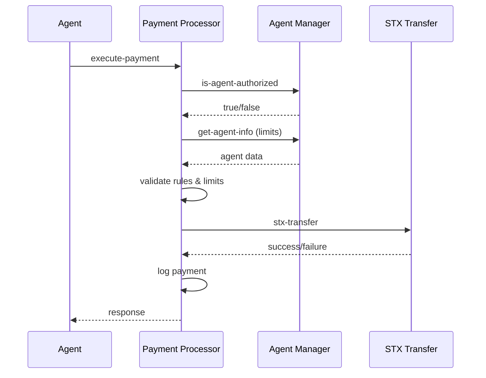

# Payment Processor Smart Contract

Path: `contracts/payment-processor.clar`

Processes agent-initiated payments with rule validation, rate/spending limits, emergency halts, and audit logging. Integrates with `contracts/agent-manager.clar` for authorization and spending limits.

## Quick Start

1. **Deploy Contract**: Use `scripts/deploy-contracts.js` after agent-manager
2. **Initialize**: Call `init-contract` with admin address
3. **Set Rules**: Call `update-payment-rules` with max amounts and recipients
4. **Execute Payments**: Agents call `execute-payment` for STX transfers
5. **Monitor**: Use `get-payment-history` for audit trails

## Prerequisites

- `agent-manager.clar` deployed and initialized
- Payment processor deployed and initialized
- Agents registered and authorized in agent-manager
- Payment rules configured for each agent

## Data Model

- `contract-owner` (data-var optional principal)
- `global-halt` (data-var bool)
- `agent-halt` (map) `{ agent-id } -> { halted: bool }`
- `payment-rules` (map) `{ agent-id } -> { max-amount: uint, version: uint }`
- `allowed-recipient` (map) `{ agent-id, version, recipient } -> { allowed: bool }`
- `rate-limiter` (map) `{ agent-id } -> { last-block: uint }`
- `spend-daily` (map) `{ agent-id, day } -> { total: uint }`
- `spend-monthly` (map) `{ agent-id, month } -> { total: uint }`
- `payment-counter` (map) `{ agent-id } -> { seq: uint }`
- `payment-history` (map) `{ agent-id, seq } -> { recipient, amount, success, block, memo }`

## Errors

- `u200` NOT-INITIALIZED
- `u201` ALREADY-INITIALIZED
- `u202` UNAUTHORIZED
- `u203` AGENT-NOT-FOUND
- `u204` HALTED
- `u205` RULES-NOT-FOUND
- `u206` AMOUNT-TOO-HIGH (unused reserved)
- `u207` RECIPIENT-NOT-ALLOWED
- `u208` DAILY-LIMIT
- `u209` MONTHLY-LIMIT
- `u210` RATE-LIMIT
- `u211` MULTISIG-REQUIRED
- `u212` INVALID-PARAMS

## Events

- `{"init", owner}`: initialization
- `{"update-rules", agent, max, version}`: rules updated
- `{"halt", agent}` / `{"resume", agent}`: agent-level halt toggled
- `{"payment", agent, recipient, amount, success}`: each attempt logged

## Public/Read-Only Functions

- `(init-contract (owner principal)) => (response bool uint)`
- `(update-payment-rules (agent-id principal) (max-amount uint) (allowed-recipients (list 20 principal))) => (response bool uint)`
- `(emergency-halt-payments (agent-id principal)) => (response bool uint)`
- `(resume-payments (agent-id principal)) => (response bool uint)`
- `(validate-payment-rules (agent-id principal) (amount uint)) => (response bool uint)`
  - Ensures: not halted, sender equals agent-id, agent authorized in `agent-manager`, `amount` <= per-payment `max-amount`.
- `(execute-payment (agent-id principal) (recipient principal) (amount uint) (memo (optional (string-ascii 200)))) => (response bool uint)`
  - Enforces whitelist, rate limit, daily/monthly limits (from `agent-manager`), and transfers STX.
  - Logs success/failure and updates accounting.
- `(get-payment-history (agent-id principal) (limit uint)) => (response (list 20 (tuple ...)) uint)`
  - Returns up to the most recent entries (current implementation may return up to 20 but optimized for recent-first; due to Clarity iteration constraints, a compact window is recommended).

## Security Features

- Authorization check via `agent-manager.is-agent-authorized` and owner/admin checks for settings.
- Time-based spending caps using block-derived day/month buckets.
- Rate limiting per agent using block spacing.
- Recipient whitelisting with versioned index to avoid state bloat.
- Emergency per-agent halt, plus global halt support (`global-halt`).
- Multi-signature: large payments currently gated by `ERR-MULTISIG-REQUIRED` when `amount > max-amount`. Hook for integrating a multisig wallet can replace this gate.

## Integration

- Requires `contracts/agent-manager.clar` deployed at `.agent-manager`.
- Reads `owner`, `daily-limit`, and `monthly-limit` from `get-agent-info`.
- Reads authorization from `is-agent-authorized`.

## Example Usage

### Contract Deployment & Setup

```bash
# Deploy using script (after agent-manager)
cd scripts
export DEPLOYER_PRIVATE_KEY=0x...
npm run deploy

# Manual deployment
stx deploy_contract payment-processor contracts/payment-processor.clar --testnet
stx call_contract_func ST_DEPLOYER.payment-processor init-contract ST_ADMIN_ADDRESS --testnet
```

### Configure Payment Rules (Clarity)

```clarity
;; Set payment rules for agent
(contract-call? .payment-processor update-payment-rules 
  'SP2CY5V39NHDPWSXMW9QDT3HC3GD6Q6XX4CFRK9AG  ;; agent-id
  u1000000  ;; max 1 STX per payment
  (list 'SP3RECIPIENT1 'SP3RECIPIENT2))  ;; allowed recipients

;; Emergency halt if needed
(contract-call? .payment-processor emergency-halt-payments 
  'SP2CY5V39NHDPWSXMW9QDT3HC3GD6Q6XX4CFRK9AG)

;; Resume payments
(contract-call? .payment-processor resume-payments 
  'SP2CY5V39NHDPWSXMW9QDT3HC3GD6Q6XX4CFRK9AG)
```

### Execute Payments (Agent)

```clarity
;; Agent executes payment (tx-sender must equal agent-id)
(contract-call? .payment-processor execute-payment 
  'SP2CY5V39NHDPWSXMW9QDT3HC3GD6Q6XX4CFRK9AG  ;; agent-id
  'SP3RECIPIENT1  ;; recipient
  u500000  ;; 0.5 STX
  (some "Invoice #42"))  ;; memo

;; Validate rules before payment
(contract-call? .payment-processor validate-payment-rules 
  'SP2CY5V39NHDPWSXMW9QDT3HC3GD6Q6XX4CFRK9AG 
  u500000)

;; Query payment history
(contract-call? .payment-processor get-payment-history 
  'SP2CY5V39NHDPWSXMW9QDT3HC3GD6Q6XX4CFRK9AG 
  u10)  ;; last 10 payments
```

### Backend API Integration

```javascript
// Process payment via backend API
const response = await fetch('http://localhost:3001/api/payments/process', {
  method: 'POST',
  headers: {
    'Authorization': 'Bearer your_token',
    'Content-Type': 'application/json'
  },
  body: JSON.stringify({
    agentId: 'SP2CY5V39NHDPWSXMW9QDT3HC3GD6Q6XX4CFRK9AG',
    amount: 500000,  // 0.5 STX in microSTX
    recipient: 'SP3RECIPIENT1',
    memo: 'API payment'
  })
});

// Get payment history
const history = await fetch(
  'http://localhost:3001/api/payments/history?agentId=SP2CY5V39NHDPWSXMW9QDT3HC3GD6Q6XX4CFRK9AG',
  { headers: { 'Authorization': 'Bearer your_token' } }
);
```

## Security Features

### Multi-Layer Validation

1. **Agent Authorization**: Checks `agent-manager.is-agent-authorized`
2. **Spending Limits**: Enforces daily/monthly limits from agent-manager
3. **Payment Rules**: Per-payment max amount validation
4. **Recipient Whitelist**: Only allowed recipients can receive payments
5. **Rate Limiting**: Prevents rapid-fire payments
6. **Emergency Halts**: Admin can halt payments per agent or globally

### Audit Trail

All payments are logged with:
- Agent ID and recipient
- Amount and success status
- Block height and memo
- Sequential numbering per agent

## Integration Flow



## Notes

- **STX Only**: Currently supports STX transfers; extend for SIP-010 tokens
- **Rate Limiting**: Block-based timing prevents spam
- **Multisig**: Large payments can be routed through multisig contracts
- **Upgrades**: Contract is immutable; deploy new version for changes
